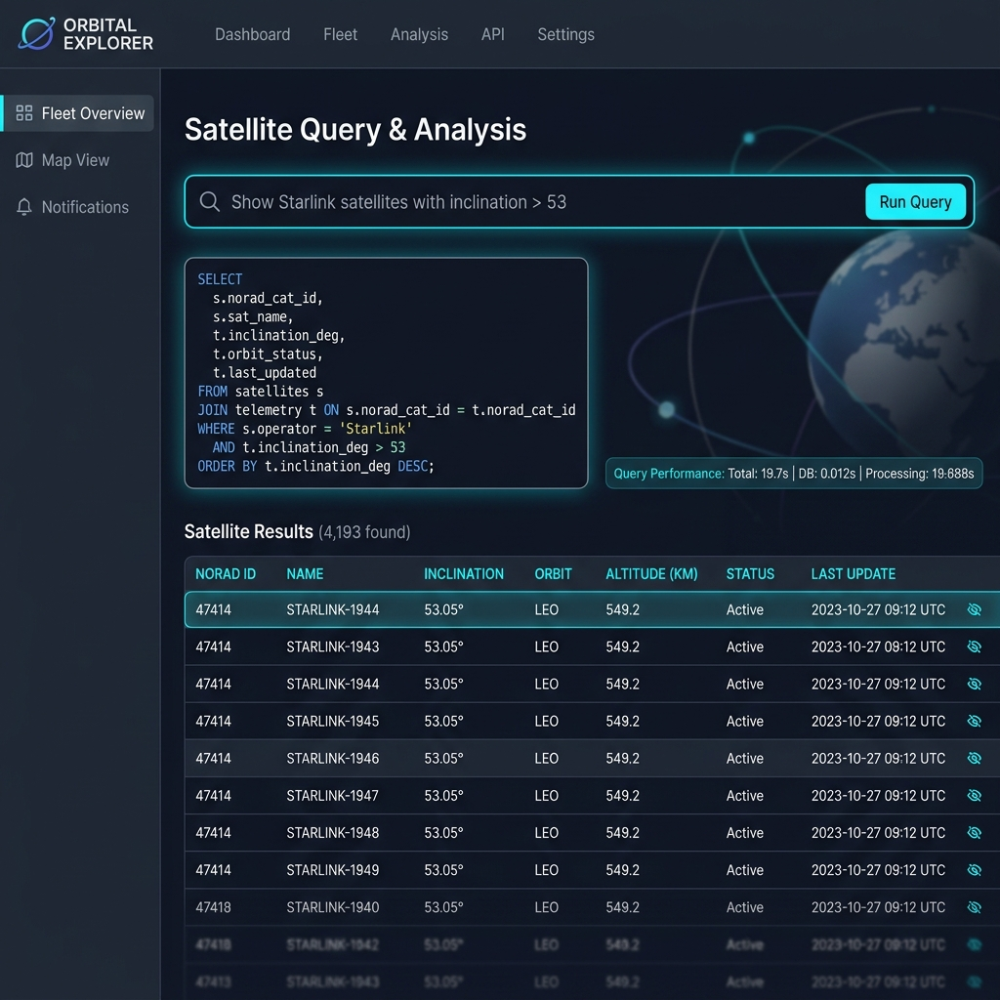
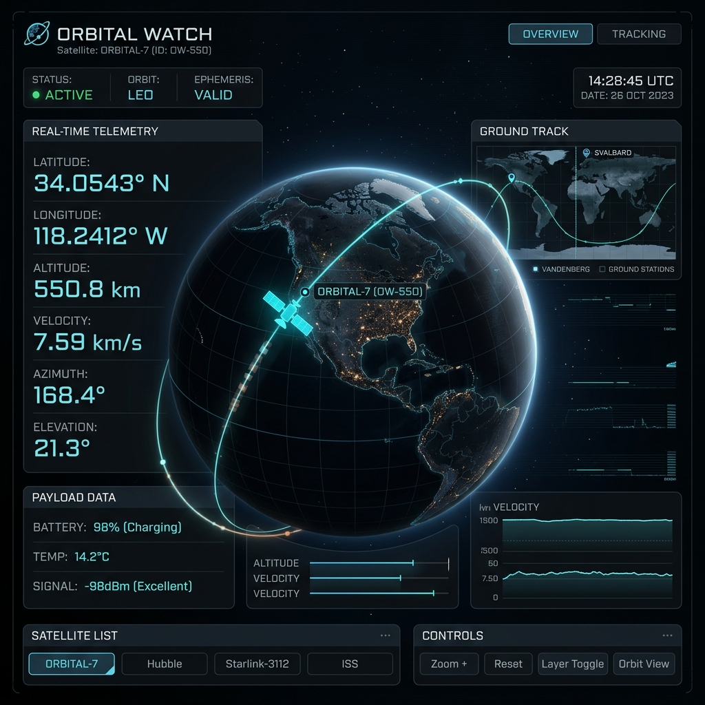
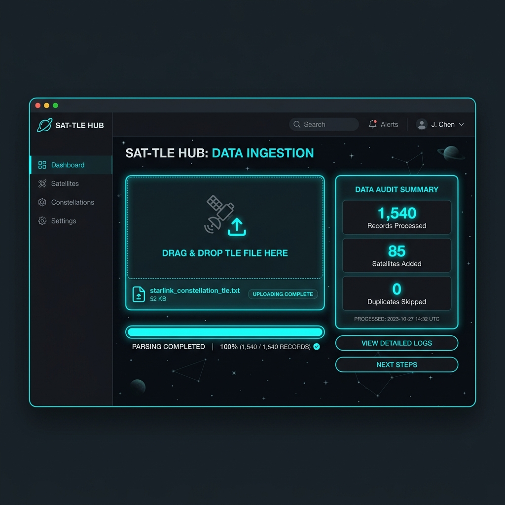
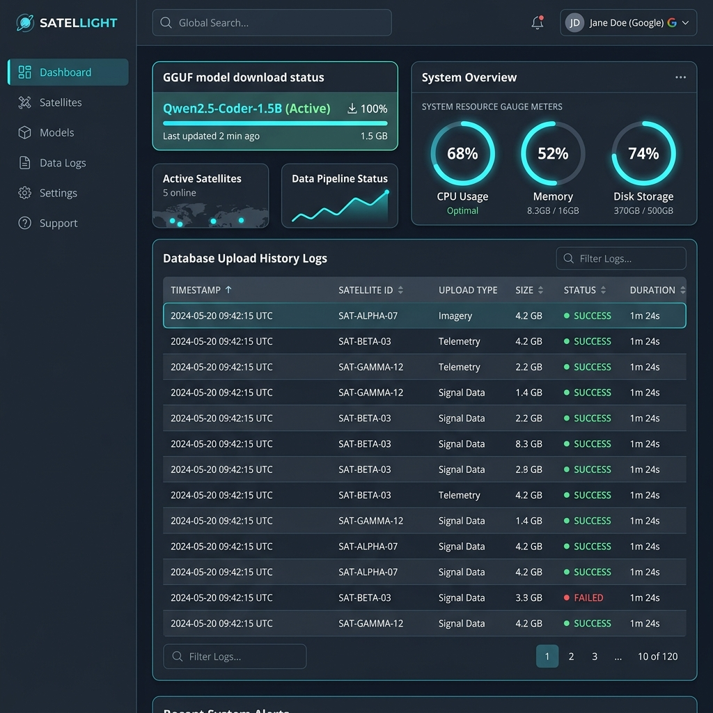

# 🛰️ Satellite TLE Tracker & AI Orbital Discovery

[](https://www.python.org/)
[](https://flask.palletsprojects.com/)
[](https://www.sqlalchemy.org/)
[](https://github.com/abetlen/llama-cpp-python)
[](https://huggingface.co/new-space)
[](https://www.pythonanywhere.com/)
[](sbom.json)
[](https://sethusrinivasan.github.io/satellite-tracker/)

A demonstration and experimental Flask web application for uploading, parsing, exploring, and tracking satellite [Two-Line Element (TLE)](https://en.wikipedia.org/wiki/Two-line_element_set) data. Features real-time [SGP4 (Simplified General Perturbations 4)](https://en.wikipedia.org/wiki/Simplified_General_Perturbations_models) orbit propagation, country proximity filtering, interactive 2D/3D map tracking, and an **in-process offline Text-to-SQL AI natural language search** powered by [Qwen2.5-Coder](https://huggingface.co/Qwen/Qwen2.5-Coder-1.5B-Instruct).

> ℹ️ **Project Status & Disclaimer**: This is an open demonstration and proof-of-concept project intended for educational, research, and experimental exploration. No production-grade assurances or SLAs are guaranteed. Please feel free to review, copy, fork, adapt, and enhance the code for your own projects!

---

## 🌟 Key Features

- 🛰️ **3-Line TLE Ingestion & Parsing**: Parses standard [TLE format](https://celestrak.org/columns/v04n03/) records, extracts key [Keplerian orbital elements](https://en.wikipedia.org/wiki/Orbital_elements) ([Inclination](https://en.wikipedia.org/wiki/Orbital_inclination), [Eccentricity](https://en.wikipedia.org/wiki/Orbital_eccentricity), [RAAN](https://en.wikipedia.org/wiki/Right_ascension_of_the_ascending_node), [Argument of Perigee](https://en.wikipedia.org/wiki/Argument_of_periapsis), [Mean Motion](https://en.wikipedia.org/wiki/Mean_motion), [BSTAR Drag Term](https://en.wikipedia.org/wiki/BSTAR)), and calculates UTC [Epoch](https://en.wikipedia.org/wiki/Epoch_(astronomy)) timestamps.
- 🔄 **Deduplication Engine**: Database indexing by [NORAD Catalog Number](https://en.wikipedia.org/wiki/Satellite_Catalog_Number) (`norad_cat_id`) and unique `(satellite_id, epoch_datetime)` constraints avoids duplicate record ingestion upon re-uploading.
- 💬 **Offline AI Natural Language Search ([Text-to-SQL](https://en.wikipedia.org/wiki/Text-to-SQL))**:
  - Runs 100% offline using [`llama-cpp-python`](https://github.com/abetlen/llama-cpp-python) and the quantized [`GGUF`](https://github.com/ggerganov/ggml/blob/master/docs/gguf.md) model `Qwen2.5-Coder-1.5B-Instruct-Q4_K_M.gguf`.
  - Translates plain English prompts (e.g., *"Find satellites with inclination > 50 degrees"*) into SQL queries.
  - Built-in SQL safety validation filter blocks non-`SELECT` statements (`DROP`, `DELETE`, `UPDATE`, `INSERT`, `ALTER`, etc.).
- 🌍 **Geo-Spatial & Country Proximity Search**: Computes real-time satellite orbital positions using [SGP4 orbital propagation](https://en.wikipedia.org/wiki/Simplified_General_Perturbations_models) to discover satellites currently passing over specific countries or geographical bounding boxes.
- 🛰️ **Live 2D & 3D Globe Tracker**: Multi-satellite real-time tracking interface showing ground track coordinates, altitude, velocity, and orbital path projections rendered via [satellite.js](https://github.com/shashwatak/satellite-js).
- 🔐 **Admin Management & Google OAuth2**: Protected dashboard for managing uploads, database resets, clearing seed flags, and monitoring local GGUF model downloads secured via [Google OAuth 2.0](https://developers.google.com/identity/protocols/oauth2).

---

## 🖼️ Visual Application Feature Showcase

> 💡 **UI Alignment & Component Layout Note**: The visual mockups below showcase high-fidelity conceptual design previews for the application features. The accompanying component layout wireframes map 1-to-1 to the live Flask template elements (`app/templates/report.html`, `app/templates/tracker.html`, `app/templates/upload.html`, `app/templates/admin.html`), including exact field names, performance metrics badges (`⚡ System Performance`), TLE parameters, and dark-mode styling.

### 1. 💬 Offline AI Natural Language Search (Text-to-SQL)
Translates plain English queries into validated read-only SQL queries using local GGUF model inference with real-time CPU system load reporting and execution metrics breakdown.



```
+-----------------------------------------------------------------------------------+
| 💬 AI Natural Language Search                                                     |
| Prompt: "Show Starlink satellites with inclination > 53 degrees"                  |
| [ 🔍 Ask AI Assistant ]                                                          |
+-----------------------------------------------------------------------------------+
| ⚙️ Processing prompt... (Local GGUF AI inference active — CPU load expected)      |
| Elapsed: 4.2s                                                                     |
+-----------------------------------------------------------------------------------+
| ⚡ System Performance: Total 19.74s (LLM Inference: 19.72s · DB: 0.012s)          |
| 🛠️ Generated SQL:                                                                 |
| SELECT s.norad_cat_id, s.name, t.inclination_deg, t.mean_motion_rev_day           |
| FROM satellites s JOIN tle_elements t ON s.id = t.satellite_id                    |
| WHERE t.inclination_deg > 53.0 LIMIT 50;                                          |
+-----------------------------------------------------------------------------------+
| NORAD ID | Name        | Inclination | Mean Motion (rev/day) | Actions            |
| 44713    | STARLINK-10 | 53.05°      | 15.06                 | [ Track Orbit 🛰️ ] |
| 44714    | STARLINK-11 | 53.06°      | 15.06                 | [ Track Orbit 🛰️ ] |
+-----------------------------------------------------------------------------------+
```

---

### 2. 🛰️ Live 2D Ground Track & 3D Globe Satellite Tracker
Interactive 2D Leaflet ground track map and 3D globe visualization rendering real-time orbital path projections, ground station footings, and position vectors.



```
+-----------------------------------------------------------------------------------+
| 🛰️ Live Satellite Orbital Tracker: STARLINK-11 (NORAD #44714)                     |
| Latitude: 34.05° N | Longitude: 118.24° W | Altitude: 550.2 km | Velocity: 7.59 km/s|
+-----------------------------------------------------------------------------------+
|  [ 2D Ground Track Map ]                  |  [ 3D Globe Projection View ]         |
|  . . . . . . . . . . . . . . . . . . . .  |          .---.                        |
|  . . . . . . . (🛰️ STARLINK) . . . . . .  |        /       \                      |
|  . . . . . ./~/~~\~\. . . . . . . . . . . |       |    🌍   |  (🛰️ Orbit Vector)  |
|  . . . . . /~/    \~\ . . . . . . . . . . |        \       /                      |
|  . . . . . . . . . . . . . . . . . . . .  |          '---'                        |
+-----------------------------------------------------------------------------------+
```

---

### 3. 📥 3-Line TLE Ingestion & Deduplication Upload Interface
Parses 3-line and 2-line TLE dataset files, verifies modulo-10 checksums, extracts Keplerian elements, and prevents duplicate epoch ingestion.



```
+-----------------------------------------------------------------------------------+
| 📥 Upload & Ingest TLE Data File                                                  |
| Select File: [ starlink_tle.txt ]                                                 |
| Session Label: [ April 2025 Constellation Batch ]                                 |
| [ 🚀 Parse & Import TLE Dataset ]                                                |
+-----------------------------------------------------------------------------------+
| 📊 Ingestion Audit Summary Report:                                                |
| Total Records Processed : 1,540                                                   |
| New Satellites Created  : 85                                                      |
| Updated Satellites      : 1,455                                                    |
| Duplicate Epochs Skipped: 0                                                       |
+-----------------------------------------------------------------------------------+
```

---

### 4. 🔐 Protected Admin Dashboard & OAuth Access Control
Administrative interface for managing upload sessions, triggering local GGUF model downloads, clearing seed flags, and monitoring system resource allocations.



```
+-----------------------------------------------------------------------------------+
| 🔐 Admin Control Center                                    Logged in as: admin    |
+-----------------------------------------------------------------------------------+
| 🤖 Offline AI Model Status: qwen2.5-coder-1.5b-instruct-q4_k_m.gguf [ Active ]    |
| [ 🔄 Re-Download Model ]  [ 🗑️ Wipe Database ]  [ ⚡ Reset Seed Flag ]             |
+-----------------------------------------------------------------------------------+
| Upload History Log:                                                               |
| ID | Filename         | Upload Time          | Records | Source      | Actions   |
| 1  | kaggle_tle.txt   | 2026-09-02 10:00 UTC | 1,540   | user_upload | [Delete]  |
+-----------------------------------------------------------------------------------+
```

---

## 📚 Domain Terminology Reference Guide

For detailed explanations of space domain, orbital mechanics, and artificial intelligence terminology used in this application, please refer to the following authoritative resources:

| Term / Acronym | Definition & Domain | Reference Link |
| :--- | :--- | :--- |
| **TLE** | Two-Line Element Set format for satellite orbital state vectors | [CelesTrak TLE Guide](https://celestrak.org/columns/v04n03/) / [Wikipedia](https://en.wikipedia.org/wiki/Two-line_element_set) |
| **NORAD Catalog ID** | 5-digit sequential number assigned by USSPACECOM | [Wikipedia: Satellite Catalog Number](https://en.wikipedia.org/wiki/Satellite_Catalog_Number) |
| **SGP4** | Simplified General Perturbations model 4 for satellite orbit propagation | [Space-Track.org Documentation](https://www.space-track.org/) / [Wikipedia](https://en.wikipedia.org/wiki/Simplified_General_Perturbations_models) |
| **Inclination** | Vertical tilt of the satellite's orbit relative to Earth's equator (degrees) | [Wikipedia: Orbital inclination](https://en.wikipedia.org/wiki/Orbital_inclination) |
| **Eccentricity** | Shape of the orbit (0 = circular, 0 < e < 1 = elliptical) | [Wikipedia: Orbital eccentricity](https://en.wikipedia.org/wiki/Orbital_eccentricity) |
| **RAAN** | Right Ascension of the Ascending Node (longitude of orbital node) | [Wikipedia: RAAN](https://en.wikipedia.org/wiki/Right_ascension_of_the_ascending_node) |
| **Argument of Perigee** | Angle between ascending node and satellite's closest point to Earth | [Wikipedia: Argument of periapsis](https://en.wikipedia.org/wiki/Argument_of_periapsis) |
| **Mean Motion** | Number of complete revolutions a satellite completes per day (rev/day) | [Wikipedia: Mean motion](https://en.wikipedia.org/wiki/Mean_motion) |
| **BSTAR Drag** | Model parameter representing atmospheric drag force on the satellite | [Wikipedia: BSTAR](https://en.wikipedia.org/wiki/BSTAR) |
| **Epoch** | Specific UTC time instant at which the orbital parameters were measured | [Wikipedia: Epoch (astronomy)](https://en.wikipedia.org/wiki/Epoch_(astronomy)) |
| **GGUF** | Binary file format for compact LLM quantization and execution | [GGML / GGUF Specification](https://github.com/ggerganov/ggml/blob/master/docs/gguf.md) |
| **Text-to-SQL** | Natural language processing technique mapping text to database SQL queries | [Wikipedia: Text-to-SQL](https://en.wikipedia.org/wiki/Text-to-SQL) |

---

## 📖 Documentation & Architecture

Detailed project architecture and design documentation are available in the repository and published on **[GitHub Pages](https://sethusrinivasan.github.io/satellite-tracker/)**:

- 🏗️ **[Architecture Overview](docs/architecture.md)** — Blueprints, database ER diagram, security filters, and offline LLM engine.
- 🛡️ **[Threat Model & Risk Analysis](docs/threat_model.md)** — STRIDE risk categorization matrix, SQL injection prevention, and security controls.
- 🎨 **[Design System & UI/UX](docs/design.md)** — Dark mode palette, visual tokens, and responsive layout guidelines.
- 📌 **[Known Issues & TODO Roadmap](docs/known_issues.md)** — Tracked technical limitations, workarounds, and enhancement items on [GitHub Issues](https://github.com/sethusrinivasan/satellite-tracker/issues).
- 📋 **[Software Bill of Materials (SBOM)](sbom.json)** — Machine-readable CycloneDX 1.5 JSON dependency inventory.
- 📑 **[GitHub Pages Documentation Site](docs/index.md)** — Hosted project documentation.


---

## 🚀 Quick Start

### 1. Prerequisites

- **Python 3.9+**
- `gcc` / C++ compiler (required for compiling `llama-cpp-python` C++ bindings)

### 2. Installation

```bash
# Clone the repository
git clone https://github.com/sethusrinivasan/satellite-tracker.git
cd satellite-tracker

# Create and activate virtual environment
python3 -m venv venv
source venv/bin/activate

# Install dependencies
pip install -r requirements.txt
```

### 3. Environment Configuration (Optional for OAuth)

Copy the `.env.example` file to create a local `.env`:

```bash
cp .env.example .env
```

To enable Google OAuth for the Admin panel:
1. Obtain Google OAuth credentials from the [Google Cloud Console](https://console.cloud.google.com/apis/credentials).
2. Set `GOOGLE_CLIENT_ID` and `GOOGLE_CLIENT_SECRET` in `.env`.
3. Set `ADMIN_ALLOWED_EMAILS` to restrict access to authorized user emails.

### 4. Running the Application

```bash
# Using the run script
bash run.sh

# Or directly with Python
python3 run.py
```

Open your browser and navigate to **[http://localhost:5000](http://localhost:5000)**.

---

## 🚀 Cloud & 1-Click Deployment Options

> ⚠️ **Important Billing & Cost Disclaimer**: Prior to deploying to commercial cloud providers (AWS, GCP, Azure, DigitalOcean, Render), please carefully review the respective provider's pricing structures, billing policies, and free tier quotas. Running continuous container instances or GGUF AI model workloads may incur cloud compute costs depending on instance sizing and runtime duration.

### 🆓 100% Free Hosting Options (No Credit Card Required)

#### 1. Hugging Face Spaces (Recommended for AI Models — 100% Free)
Hugging Face Spaces offers a **100% free 16 GB RAM CPU tier** with zero credit card requirements, ideal for hosting GGUF local model inference:

[-FFD21E?style=for-the-badge&logo=huggingface&logoColor=black)](https://huggingface.co/new-space)

1. Click **Deploy to Hugging Face** above to create a free Space.
2. Select **Docker** as the Space SDK (Blank).
3. Connect your GitHub repository `sethusrinivasan/satellite-tracker`.

#### 2. PythonAnywhere (100% Free Web Host — No Credit Card Required)
PythonAnywhere offers a **100% free beginner tier** for Python/Flask web applications:

[](https://www.pythonanywhere.com/)

---

### ☁️ Major Commercial Cloud Providers (1-Click Deployments)

#### 1. Google Cloud Platform (GCP Cloud Run)
Deploy directly to serverless Google Cloud Run using the container [`Dockerfile`](Dockerfile):

[](https://deploy.cloud.run/?git_repo=https://github.com/sethusrinivasan/satellite-tracker.git)

#### 2. DigitalOcean App Platform
Launch a managed app container on DigitalOcean App Platform:

[](https://cloud.digitalocean.com/apps/new?repo=https://github.com/sethusrinivasan/satellite-tracker/tree/main)

#### 3. Amazon Web Services (AWS App Runner / ECS)
Deploy containerized workloads to AWS App Runner or Amazon ECS:

[](https://console.aws.amazon.com/apprunner)

#### 4. Microsoft Azure App Service
Deploy Linux web app containers to Azure App Service:

[](https://portal.azure.com/#create/Microsoft.Template)

#### 5. Render Web Services
Deploy to Render using GitHub repository integration:

[](https://render.com/deploy?repo=https://github.com/sethusrinivasan/satellite-tracker)

---

### 🐳 Self-Hosted Container Deployment (Docker — 100% Free)
Build and run on any local machine or self-hosted server with zero external dependencies or costs:

```bash
# Build Docker image
docker build -t satellite-tracker .

# Run container locally
docker run -p 5000:5000 --env-file .env satellite-tracker
```

---

## 🤖 Setting Up Offline AI Search

1. Navigate to the **Admin Panel** (`/admin`).
2. Under **Offline AI Model Management**, click **Download Model**.
3. The system will stream the `Qwen2.5-Coder-1.5B-Instruct-Q4_K_M.gguf` file (~900MB) from HuggingFace to `app/models/`.
4. Once downloaded, switch to the **💬 AI Search** tab on the main page to ask natural language questions!

---

## 📁 Repository Structure

```
satellite-tracker/
├── app/
│   ├── models/            # Directory for local GGUF model binaries (git-ignored)
│   ├── routes/
│   │   ├── admin.py       # Admin dashboard & AI model download endpoints
│   │   ├── auth.py        # Google OAuth2 login & session management
│   │   ├── report.py      # Search, natural language Text-to-SQL, & API routes
│   │   └── upload.py      # File ingestion & seed auto-import
│   ├── services/
│   │   ├── db_service.py  # SQLAlchemy persistence & deduplication logic
│   │   ├── geo_query_service.py # SGP4 propagation & bounding box filtering
│   │   └── tle_parser.py  # TLE line format parsing & checksum validation
│   ├── static/            # CSS & JS assets
│   ├── templates/         # Jinja2 HTML templates
│   └── models.py          # SQLAlchemy ORM models (Satellite, TLEElement, Upload)
├── data/                  # Local directory for user datasets (git-ignored)
├── docs/
│   ├── index.md           # GitHub Pages landing page
│   ├── architecture.md    # System architecture & database schema
│   └── design.md          # UI/UX design tokens & visual components
├── instance/              # SQLite database & file upload storage (git-ignored)
├── config.py              # Application settings
├── requirements.txt       # Dependencies
├── run.py                 # Application launcher
└── run.sh                 # Convenience execution script
```

---

## 📊 Sample Datasets & Reference Data

Sample TLE datasets can be retrieved directly from public orbital data sources or Kaggle:

1. **Starlink Satellite TLE Dataset** (Kaggle):  
   [Starlink Satellite TLE CSV Dataset](https://www.kaggle.com/datasets/vijayj0shi/starlink-satellite-tlecsv-dataset-april-2025?select=starlink_tle.txt) by Vijay Joshi. Save the raw text file to `data/kaggle_tle_data.txt` for local auto-seeding.
2. **CelesTrak Active Satellites TLE Data**:  
   [CelesTrak Active Satellites](https://celestrak.org/NORAD/elements/gp.php?GROUP=active&FORMAT=tle) — Real-time active satellite element sets. Download and upload directly via the web UI at `/upload`.

---

## 🤖 AI Assistance Acknowledgment

This repository and codebase were developed with pair-programming assistance from **Antigravity**, an AI agentic coding assistant developed by Google DeepMind. AI tools were used to generate initial code scaffolding, assist with architectural documentation, draft threat models, and format dependency inventories. All code, security controls, and design decisions have been thoroughly reviewed and validated by human maintainers.

---

## 🤝 Contributing & License

This demonstration project is open-source under the [MIT License](LICENSE). Contributions, bug reports, feature suggestions, and enhancements are welcome! Feel free to fork, adapt, and build upon this project.

