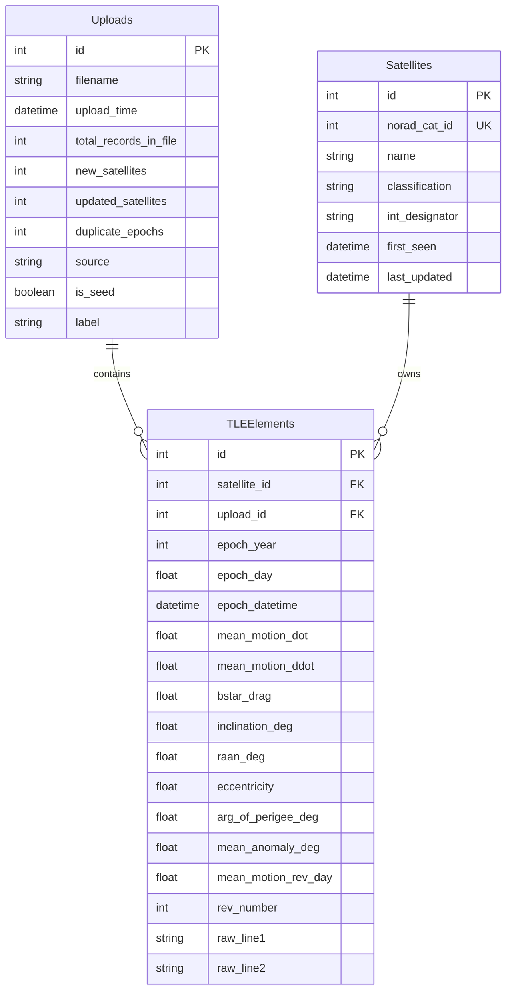

# 🏗️ Satellite Tracker System Architecture

This document provides a comprehensive overview of the **Satellite TLE Tracker & AI Orbital Discovery** platform architecture, data flows, components, and security mechanisms.

---

## 1. System Overview

The application is built using a modern, modular Flask architecture. It integrates a relational database engine (SQLAlchemy + SQLite), real-time orbital propagation (`satellite.js` client-side & Python propagation backend), Google OAuth2 admin security, and an in-process offline Text-to-SQL AI engine (`llama-cpp-python` with Qwen2.5-Coder-1.5B).

```
+-----------------------------------------------------------------------------------+
|                                 User Interface                                    |
|   Keyword Search  |  Country Proximity Search  |  Offline AI Search  |  3D Tracker|
+-----------------------------------------------------------------------------------+
                                          |
                                    HTTP / JSON API
                                          v
+-----------------------------------------------------------------------------------+
|                                 Flask Application                                 |
|                                                                                   |
|  +--------------------+   +-----------------------+   +------------------------+  |
|  |  upload_bp Blueprint|   |  report_bp Blueprint  |   |   admin_bp Blueprint   |  |
|  |  - TLE ingestion   |   |  - Search & Filtering |   |   - Database reset     |  |
|  |  - Deduplication   |   |  - Natural Language   |   |   - GGUF model download|  |
|  +--------------------+   |    Query Engine       |   +------------------------+  |
|                           +-----------------------+                |              |
|                                       |                       Google OAuth2       |
|                                       v                            v              |
|                           +-----------------------+   +------------------------+  |
|                           |  Geo & Offline LLM    |   |   auth_bp Blueprint    |  |
|                           |  - Safety SQL filter  |   |   - @admin_required    |  |
|                           |  - llama-cpp-python   |   +------------------------+  |
|                           +-----------------------+                               |
+-----------------------------------------------------------------------------------+
                                          |
                                    SQLAlchemy ORM
                                          v
+-----------------------------------------------------------------------------------+
|                              SQLite Database Storage                              |
|   [Uploads Table]  <--->  [Satellites Table]  <--->  [TLE Elements Table]          |
+-----------------------------------------------------------------------------------+
```

---

## 2. Component Architecture

### 2.1 Ingestion & Parsing Engine (`app/services/tle_parser.py`)
- Accepts standard 3-line format TLE files (Line 0: Satellite Name, Line 1: Epoch/Drag/Classification, Line 2: Orbital Inclination, RAAN, Eccentricity, Arg of Perigee, Mean Motion).
- Validates line checksums and structure before persisting.
- Generates precise UTC datetimes from epoch year and day values.

### 2.2 Database Persistence (`app/services/db_service.py`)
- Built on SQLite via SQLAlchemy ORM.
- Implements strict deduplication:
  - Satellites are uniquely indexed by `norad_cat_id`.
  - TLE elements enforce a `(satellite_id, epoch_datetime)` unique constraint.
- Tracks upload provenance (`source`, `is_seed`, `upload_time`).

### 2.3 Geo-Spatial & Proximity Engine (`app/services/geo_query_service.py`)
- Propagates satellite SGP4 orbital parameters in real-time to compute current ground track coordinates (Latitude, Longitude, Altitude).
- Performs country bounding box queries and Haversine distance proximity sorting.
- Filters out decayed/anomalous entries automatically.

### 2.4 Offline AI Text-to-SQL Engine (`app/routes/report.py`)
- **Runtime**: In-process GGUF execution via `llama-cpp-python`. No external web calls required.
- **Model**: Compact `Qwen2.5-Coder-1.5B-Instruct-Q4_K_M.gguf`.
- **Safety Filter**: High-level regex & AST query validator (`validate_sql_safety`) ensuring **ONLY `SELECT` statements** can execute. Operations such as `DROP`, `DELETE`, `UPDATE`, `INSERT`, `ALTER` are blocked.

### 2.5 Admin Control & Google OAuth (`app/routes/admin.py`, `app/routes/auth.py`)
- Protects administrative maintenance endpoints using `@admin_required` session decorators.
- Provides background streaming thread for GGUF model download with status polling.
- Enables database resets, re-seeding, and session pruning.

---

## 3. Database Schema



---

## 4. Security Infrastructure

1. **Read-Only Text-to-SQL Security Guard**:
   - Every AI-generated query is checked prior to execution.
   - Rejects non-`SELECT` statements and blocklisted keywords (`DROP`, `DELETE`, `UPDATE`, `INSERT`, `ALTER`, `CREATE`, `REPLACE`, `PRAGMA`, `ATTACH`, `DETACH`).
2. **Session Authentication**:
   - Google OAuth 2.0 flow with restricted email allowlist capability (`ADMIN_ALLOWED_EMAILS`).
3. **Environment Security**:
   - Secret keys and OAuth credentials configured via `.env` file; excluded from version control.
