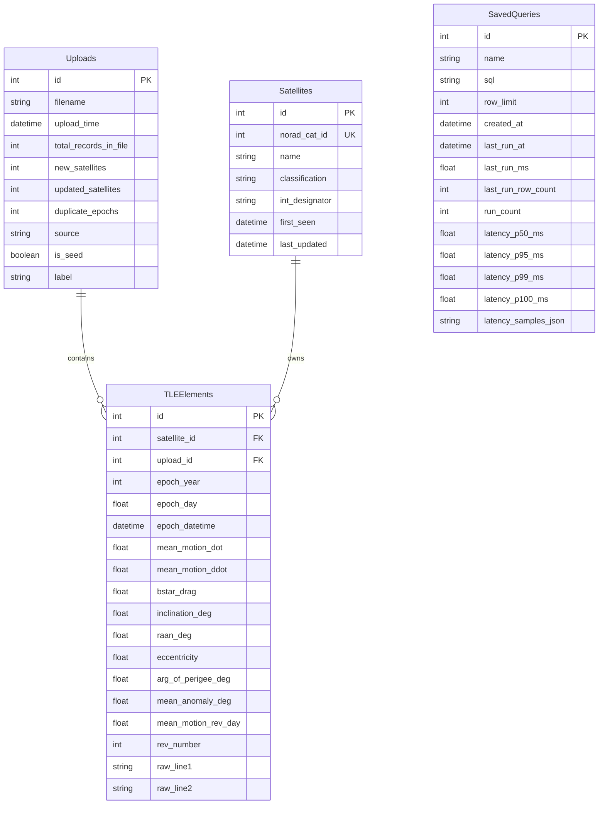

# 🏗️ Satellite Tracker System Architecture

This document provides a comprehensive overview of the **Satellite TLE Tracker & AI Orbital Discovery** platform architecture, data flows, components, and security mechanisms.

---

## 1. System Overview

The application is a modular Flask 3 app. Persistence is **SQLAlchemy 2** against either **SQLite** or **PostgreSQL** (`psycopg` 3, URI scheme `postgresql+psycopg://`). Engine choice is stored in `instance/datastore.json` so it can survive database wipes and be changed from Admin. Orbit math runs in Python (`sgp4`) and in the browser (`satellite.js`). Admin access uses Google OAuth2 with a fail-closed local bypass. Text-to-SQL runs in-process via `llama-cpp-python` and Qwen2.5-Coder-1.5B.

```
+-----------------------------------------------------------------------------------+
|                                 User Interface                                    |
|  Keyword Search (default) | Country Proximity + prefixes | Offline AI | Tracker   |
|  First-launch /setup      | Admin datastore + SQL explorer | Fullscreen maps      |
+-----------------------------------------------------------------------------------+
                                          |
                                    HTTP / JSON API
                                          v
+-----------------------------------------------------------------------------------+
|                                 Flask Application                                 |
|  setup_bp   upload_bp   report_bp   admin_bp   auth_bp                             |
|  - wizard   - GET form  - keyword   - reset    - OAuth                             |
|  - bind     - ingest    - proximity - SQL      - is_local_dev() fail-closed        |
|                         - Text-to-SQL - datastore switch                           |
|  Geo / LLM / sql_console / datastore / overlay (EONET, USGS, Open-Meteo, CNBC, OpenSky, GDACS, Digitraffic) |
+-----------------------------------------------------------------------------------+
                                          |
                         SQLAlchemy ORM  (rebind on datastore.json change)
                                          v
+-----------------------------------------------------------------------------------+
|  SQLite (instance/*.db)  or  PostgreSQL 18.6                                      |
|  uploads | satellites | tle_elements | saved_queries | system_settings            |
+-----------------------------------------------------------------------------------+
|  instance/datastore.json  (engine + URI; not stored inside the satellite tables)  |
+-----------------------------------------------------------------------------------+
```

---

## 2. Component Architecture

### 2.1 Ingestion & Parsing Engine (`app/services/tle_parser.py`)
- Accepts standard 3-line format TLE files (Line 0: Satellite Name, Line 1: Epoch/Drag/Classification, Line 2: Orbital Inclination, RAAN, Eccentricity, Arg of Perigee, Mean Motion).
- Validates line checksums and structure before persisting.
- Generates precise UTC datetimes from epoch year and day values.
- `GET /upload` renders the form; `POST /upload` ingests. `HEAD /upload` is treated as GET so probes do not hit the POST branch.

### 2.2 Datastore & Persistence (`app/services/datastore.py`, `app/services/db_service.py`)
- First launch without `DATABASE_URL` / `DB_ENGINE` redirects to `/setup`.
- `ensure_database_schema()` runs `create_all` after bind and after engine switch so tables such as `uploads` exist before routes query them.
- Missing SQLite parent directories are remapped into `instance/`.
- Optional snapshot migrate copies `uploads`, `satellites`, `tle_elements`, and `saved_queries` when the admin switches engines.
- Compose runs the app as `${SATTRACK_UID}:${SATTRACK_GID}` (from `run.sh`) so bind-mounted `instance/` files are not `root:root` mode `600`.
- If `data/kaggle_tle_data.txt` is missing, `app/services/demo_tle.py` seeds a small labelled **demo** catalogue.

### 2.3 Search (`app/routes/report.py`)
- **Keyword (default tab)**: empty `q` lists all satellites; a non-empty term `ILIKE`s name, `int_designator`, classification, cast NORAD ID, and raw TLE lines.
- **Country proximity**: `GET /api/proximity/options` returns countries that have both bounding box and center (`list_available_countries`) plus catalogue prefixes (`satellite_name_prefix`: first word, drop parentheticals and hyphen suffixes).
- **Geo engine** (`app/services/geo_query_service.py`): SGP4 propagation, Haversine sort, decayed-orbit filter.

### 2.4 Offline AI Text-to-SQL Engine (`app/routes/report.py`)
- **Runtime**: In-process GGUF execution via `llama-cpp-python`. No external web calls required.
- **Model**: Compact `Qwen2.5-Coder-1.5B-Instruct-Q4_K_M.gguf`.
- **Safety Filter**: `validate_sql_safety` / cache validator — only `SELECT`. Blocklist includes `DROP`, `DELETE`, `UPDATE`, `INSERT`, `ALTER`, `ATTACH`, `PRAGMA`.

### 2.5 Maps (`app/static/js/basemap.js`)
- Default tiles: Esri World Dark Gray + reference overlay (no API key).
- If `CARTO_API_KEY` is set, templates expose `window.SATTRACK_CARTO_KEY` and CARTO `dark_all` is used with `?key=`.
- Satellite detail (`#orbit-map-card`) and tracker (`#tracker-map-shell`) toggle a CSS fullscreen overlay and call Leaflet `invalidateSize`. Escape exits.
- Optional tracker overlays (checkboxes, off by default) are read-only proxies to **free** APIs. External overlay payloads are stored in a **shared 60-second file cache** (`app/services/overlay_cache.py`) so a second user (or a later request) reuses the same fetch instead of calling the provider again. The map credit strip and popups attribute each source:
  - `GET /api/world-events` — NASA EONET weather/climate events plus USGS earthquakes (`app/services/world_events.py`) and million-city temperature trends (`app/services/city_temperature.py`, Open-Meteo ERA5). Response includes `events` and `temperatures` (7d / 30d / 90d / 1y °C change). Quake markers include `magnitude`; the map scales bubble size and color by severity.
  - `GET /api/market-indices` — major world indexes, CNBC last + 1d % (`app/services/market_indices.py`).
  - `GET /api/currencies` — local units to buy 1 USD / EUR / yen / oz gold / barrel of WTI / Big Mac, plus 1d / 7d / 30d / 90d / 6m / 1y / 5y FX/gold % (`app/services/currency_overlay.py`; Frankfurter, CNBC, The Economist).
  - `GET /api/flights` — OpenSky Network airborne states plus adsbdb origin/destination and estimated on-time; optional `lamin/lomin/lamax/lomax` (`app/services/flight_overlay.py`).
  - `GET /api/geo-news` — GDACS disaster alerts plus Wikipedia featured stories with article coordinates; popup title links open the report/article (`app/services/news_overlay.py`).
  - `GET /api/shipping` — schematic world sea lanes plus Fintraffic Digitraffic AIS (`app/services/shipping_overlay.py`). Live ships are Finland/Baltic only (CC BY 4.0).
  - `GET /api/webcams` — official public webcam pages worldwide plus OpenStreetMap `webcam:url` via Overpass (world hubs at global scale, current bbox when zoomed in) (`app/services/webcam_overlay.py`).
- Overlay routes do not forward user search text. News uses fixed GDACS / Wikipedia feeds. No paid data vendors.

### 2.6 Web analytics (PostHog)
- Official HTML snippet in `app/templates/_posthog.html`, included from `base.html`.
- Loaded only when `POSTHOG_PROJECT_API_KEY` is set and the app is not in `TESTING`.
- Default host is `https://us.i.posthog.com` (`POSTHOG_HOST` for EU or self-hosted).
- `person_profiles: identified_only` so Web analytics stays on anonymous events. Session replay is off unless `POSTHOG_SESSION_REPLAY=true`.

### 2.7 Admin Control & Google OAuth (`app/routes/admin.py`, `app/routes/auth.py`)
- `@admin_required` plus optional `ADMIN_ALLOWED_EMAILS`.
- Google sign-in does not send `prompt=select_account`. An existing admin session is reused (`SESSION_PERMANENT`, 14-day `PERMANENT_SESSION_LIFETIME`, refreshed on activity). Sign out still clears it.
- `is_local_dev()` is **false** when `FLASK_ENV=production`. Docker / `RUNNING_IN_DOCKER` is not treated as local by itself. `/auth/dev-bypass` is only offered on localhost/dev.
- **Admin → Database → Tables & SQL editor** (`/admin/database`): table counts, read-only `SELECT` / `WITH` / `EXPLAIN`, row cap 1–10 000 (default 200), CSV/Excel export, `saved_queries` rows with last-run count and p50/p95/p99/p100 latency (`app/services/sql_console.py`).

---

## 3. Database Schema



`saved_queries` lives in the **active** datastore so saved SQL and latency percentiles survive process restarts and migrate with an engine switch.

---

## 4. Security Infrastructure

1. **Read-Only Text-to-SQL and Admin SQL**:
   - AI search: `SELECT` only; mutation keywords blocked.
   - Admin console: single statement, no stacked `;`, `SELECT` / `WITH` / `EXPLAIN` only, same mutation blocklist.
2. **Session Authentication**:
   - Google OAuth 2.0 with `ADMIN_ALLOWED_EMAILS`. Production images set `FLASK_ENV=production` so the local bypass cannot be reached on advertised 1-click/cloud deploys.
3. **Environment Security**:
   - Secrets in `.env`. `instance/datastore.json` is host-owned (`0o600`). Unreadable files are `DATASTORE_UNREADABLE`, not treated as first-launch.
4. **Uploads**:
   - `MAX_CONTENT_LENGTH` 16 MB; TLE checksum and line-length checks.
